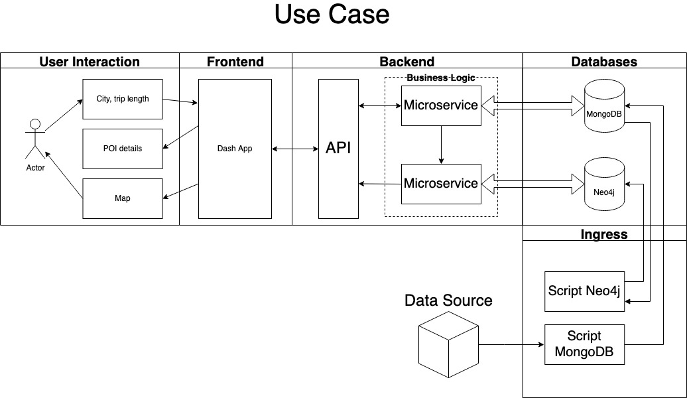

# Etape 2 : Architecture de l'organisation des données

L'architecture choisie est schématisée dans l'image ci-dessous. L'utilisateur peut choisir une ville et la durée de son voyage :

L'architecture est divisée en 4 parties : Ingress, Databases, Backend, Frontend et UI.

## 1. Ingress

Cette partie de l'architecture récupère les données de la source afin d'implémenter la base de données. La création de la base de données MongoDB se fait par l'intermédiaire d'un script, appelé [create_mongodb_collection.py](../scripts/create_mongodb_collection.py). 

## 2. Bases de données 

**MongoDB**

Cette base de données orientée document a été choisie pour sa simplicité. Étant donné que les fichiers récupérés de la source sont en format JSON, il a été relativement rapide et efficace d'alimenter la base de données MongoDB. La rapidité et la facilité d’accès sont deux points importants pour notre projet.

**Neo4j**

Il a été considéré d'utiliser en complément une deuxième base de données orientée graphe. Comme l'objectif final est de fournir un itinéraire, Neo4j nous semblait un choix évident. L'idée était d'utiliser une base de données Neo4j en parallèle à la base MongoDB pour créer l'itinéraire à partir des entrées des utilisateurs.

Avec Neo4j, il est possible d'utiliser l'algorithme de Dijkstra pour calculer le chemin le plus court entre deux noeuds. Cependant, dans notre cas, le but est de calculer le chemin le plus court qui "visite" tous les noeuds une seule fois. Ce problème est similaire à celui du "Travelling salesman problem" et n'est pas facile à implémenter sur Neo4j. C'est pour cette raison que nous avons décidé de ne pas utiliser Neo4j.
 

## 3. Backend

Le backend est constitué par une API et sa logique métier ("Business Logic") :

### a) API 

L'API sert d'interface entre les requêtes côté clients et la logique métier qui permettent de répondre à ces requêtes. Le fonctionnement de cette API est détaillé dans la [documentation de l'étape 3](./etape3.md).

### b) *Business Logic* 

La logique métier ou *Business Logic* fonctionne comme un *Service* dédié à la gestion et la consommation de données stockés dans la base MongDB.

## 4. Frondend / UI

Le frontend est une application Dash. Cette application est conçue de façon à communiquer avec l'API. Pour plus de détails concernant l'application Dash et son interaction avec l'utilisateur, se référer à la [documentation dédiée à l'application Dash](../src/dashapp/README.md).

La consommation de données se fait via une API. Les requêtes à la base de données sont gérées par des classes encapsulées dans la business logic.
